# Sistema de Movimentos - Documentacao Tecnica AS-IS

## Sumario Executivo

Este documento descreve o funcionamento do sistema de **Movimentos** no SAG Delphi. Movimentos sao registros filhos vinculados a um cabecalho (registro pai), permitindo a modelagem de relacionamentos 1:N no sistema, como:

- Nota Fiscal (cabecalho) → Itens da Nota (movimentos)
- Pedido (cabecalho) → Itens do Pedido (movimentos)
- Contrato (cabecalho) → Produtos do Contrato (movimentos)
- Colaborador (cabecalho) → Historico de Locacoes (movimentos)

---

## 1. Arquitetura Geral

### 1.1 Hierarquia de Classes

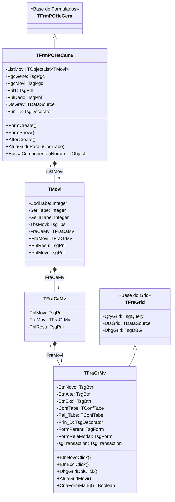

### 1.2 Arquivos Envolvidos

| Arquivo | Descricao |
|---------|-----------|
| `POHeCam6.pas` / `.dfm` | Formulario principal (cabecalho + movimentos) |
| `POFrCaMv.pas` / `.dfm` | Frame container do movimento |
| `POFrGrid.pas` / `.dfm` | Frame base com grid |
| `POFrGrMv.pas` / `.dfm` | Frame do grid de movimento (herda de POFrGrid) |
| `PlusUni.pas` | Classe TMovi e funcoes auxiliares |

### 1.3 Constantes do Formulario

| Constante | Valor | Descricao |
|-----------|-------|-----------|
| `cEspaTabe` | 10 | Espacamento entre abas |
| `cTamaTabe` | 72 | Tamanho base da aba |
| `cAltuTabe` | 10 | Altura base |
| `cAltuMovi` | 240 | Altura padrao do painel de movimento |

### 1.4 Variaveis de Instancia

| Variavel | Tipo | Descricao |
|----------|------|-----------|
| `Criado` | Boolean | Flag indicando que criacao foi concluida |
| `PrimMov1` | TControl | Primeiro controle do movimento 1 |
| `DtbCada` | TsgConn | Conexao de banco (Desktop) |
| `FPgcMovi` | TsgPgc | PageControl de movimentos (lazy-load) |
| `fListMovi` | TObjectList | Lista de movimentos |
| `fListLeitSeri` | TObjectList | Lista de leitores seriais |
| `PSitGrav` | Integer | Situacao de gravacao: 0=Visualizacao, 1=Inclusao, 2=Alteracao |
| `sgTransaction` | TsgTransaction | Transacao compartilhada cabecalho + movimentos |
| `Prin_D` | TsgDecorator | Decorator de operacoes de negocio |
| `ListPrin` | TList | Lista de decorators dos movimentos |
| `ConfTabe` | TConfTabe | Configuracoes da tabela corrente |
| `cwModoMobile` | Boolean | Flag indicando modo mobile (UniGUI) |

#### Estados de PSitGrav

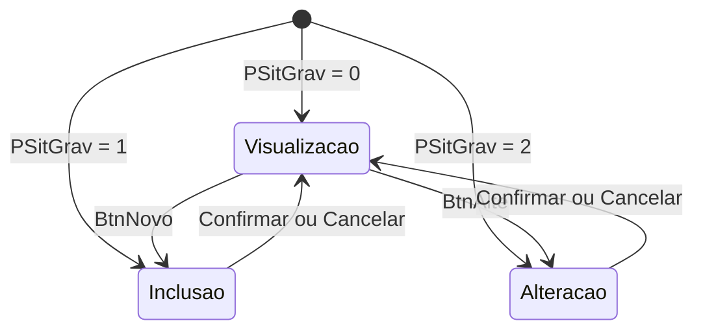

### 1.5 Queries e DataModules

O formulario POHeCam6 utiliza queries especificas do DataModule (DtmPoul) para carregar metadados:

| Query | Origem | Proposito |
|-------|--------|-----------|
| `QryTabe` | DtmPoul | Carrega metadados de movimentos (POCATABE WHERE CabeTabe = X) |
| `QryTabeGrid` | DtmPoul | Carrega configuracoes do grid (GRCOTABE, GRIDTABE) |
| `QryCalc` | DtmPoul | Carrega expressoes de calculo para campos |

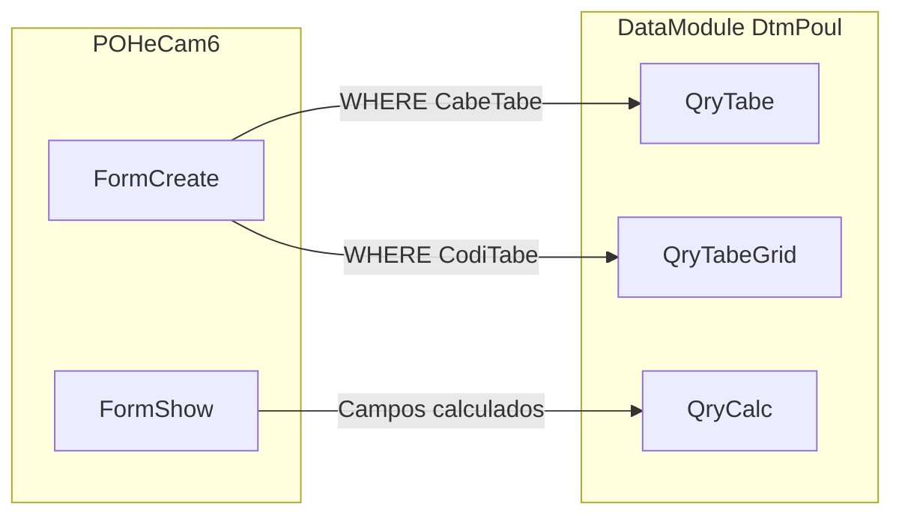

**Nota**: As queries sao compartilhadas entre todas as instancias do formulario, por isso usam parametros para filtrar os dados corretos.

---

## 2. Estrutura de Metadados (POCATABE)

### 2.1 Campos Relevantes para Movimentos

| Campo | Tipo | Descricao |
|-------|------|-----------|
| `CODITABE` | int | Codigo unico da tabela |
| `NOMETABE` | varchar(100) | Nome descritivo |
| `FORMTABE` | varchar(100) | Classe do formulario Delphi |
| `GRAVTABE` | varchar(20) | Nome da tabela SQL de gravacao |
| `CABETABE` | int | **Codigo do cabecalho pai** (se > 0, eh movimento) |
| `SERITABE` | varchar(100) | Ordenacao/posicao do movimento |
| `GETATABE` | int | Codigo alternativo de referencia |
| `GUI1TABE` | varchar(25) | Titulo da guia/aba |
| `GRIDTABE` | text | SQL do grid do movimento |
| `GRCOTABE` | text | Configuracao de colunas do grid |
| `SHOWTABE` | text | Instrucoes OnShow |
| `INSETABE` | text | Instrucoes de INSERT customizadas |
| `EPERTABE` | int | Codigo de tabela de permissoes |
| `LANCTABE` | text | Instrucoes de lancamento/processamento |
| `APOSTABE` | text | Instrucoes pos-operacao |
| `FILTABE` | int | Codigo de tabela filha |
| `VISUTABE` | bit | Flag de visualizacao |
| `ALTETABE` | bit | Flag de permissao de alteracao |
| `EXCLTABE` | bit | Flag de permissao de exclusao |

### 2.2 Relacionamento Cabecalho-Movimento

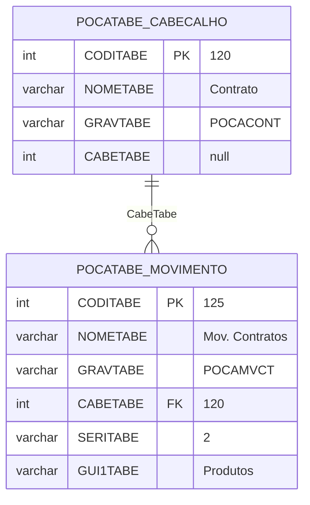

### 2.3 Significado do SERITABE

O campo `SERITABE` controla a posicao visual do movimento:

| Valor | Comportamento |
|-------|---------------|
| `> 50` | Movimento exibido na **mesma guia** do cabecalho (PgcMovi) |
| `<= 50` | Movimento exibido em **guia separada** (PgcGene) |

---

## 3. Classe TMovi (Wrapper de Movimento)

### 3.1 Definicao (PlusUni.pas:89-111)

```pascal
TMovi = class
private
  fTbsMovi: TsgTbs;        // Aba/Tab onde o movimento aparece
  fFraCaMv: TFraCaMv;      // Frame container
  fCodiTabe: Integer;      // Codigo da tabela do movimento
  fSeriTabe: Integer;      // Posicao/ordenacao
  fGeTaTabe: Integer;      // Codigo alternativo

public
  property CodiTabe: Integer;
  property GeTaTabe: Integer;
  property SeriTabe: Integer;
  property TbsMovi: TsgTbs;
  property FraCaMv: TFraCaMv;

  // Propriedades derivadas
  property FraMovi: TFraGrMv;   // Acesso ao frame interno
  property PnlResu: TsgPnl;     // Painel de resumo
  property PnlMovi: TsgPnl;     // Painel principal
end;
```

---

## 4. Ciclo de Vida dos Movimentos

### 4.1 Criacao (FormCreate - POHeCam6.pas:627-738)

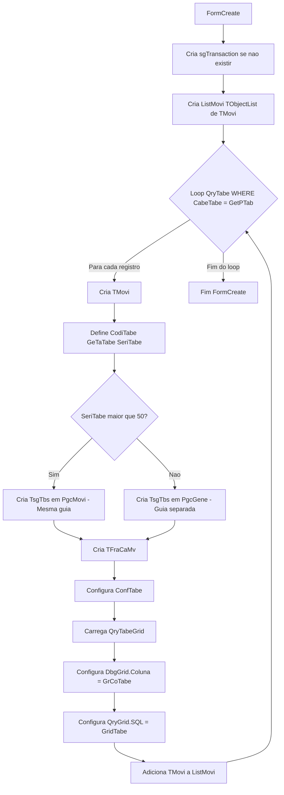

### 4.2 Inicializacao (FormShow - POHeCam6.pas:883-1054)

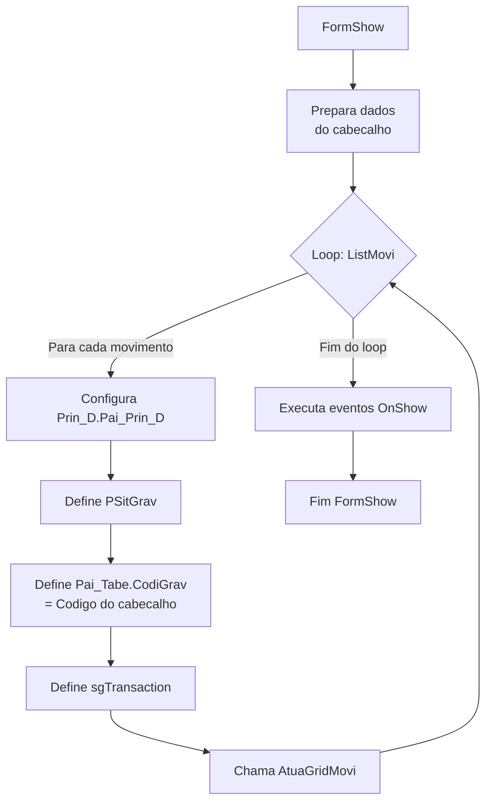

### 4.3 Atualizacao do Grid (AtuaGridMovi - POFrGrMv.pas:95-149)

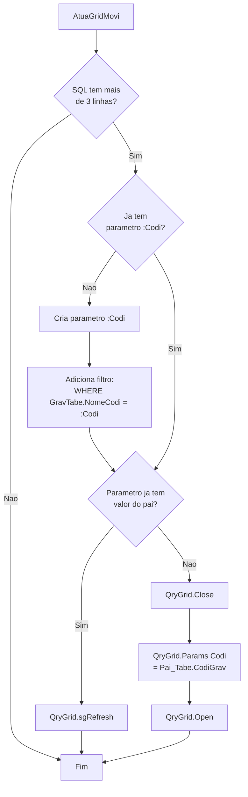

---

## 5. Operacoes CRUD nos Movimentos

### 5.1 Incluir/Alterar (BtnNovoClick - POFrGrMv.pas:299-414)

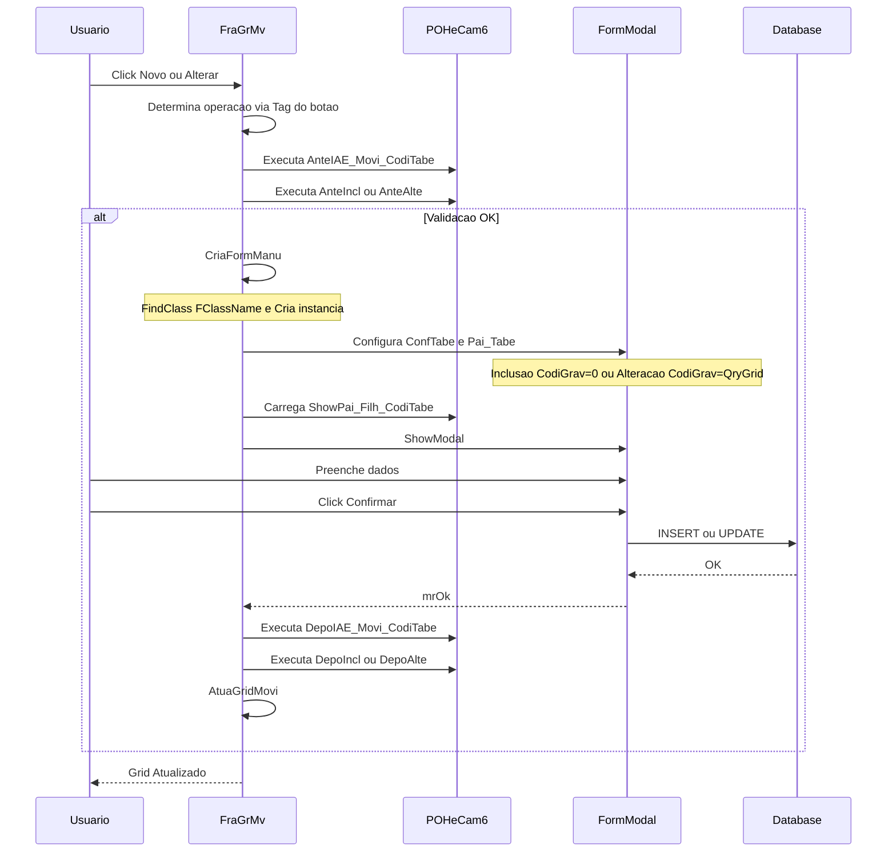

### 5.2 Excluir (BtnExclClick - POFrGrMv.pas:227-297)

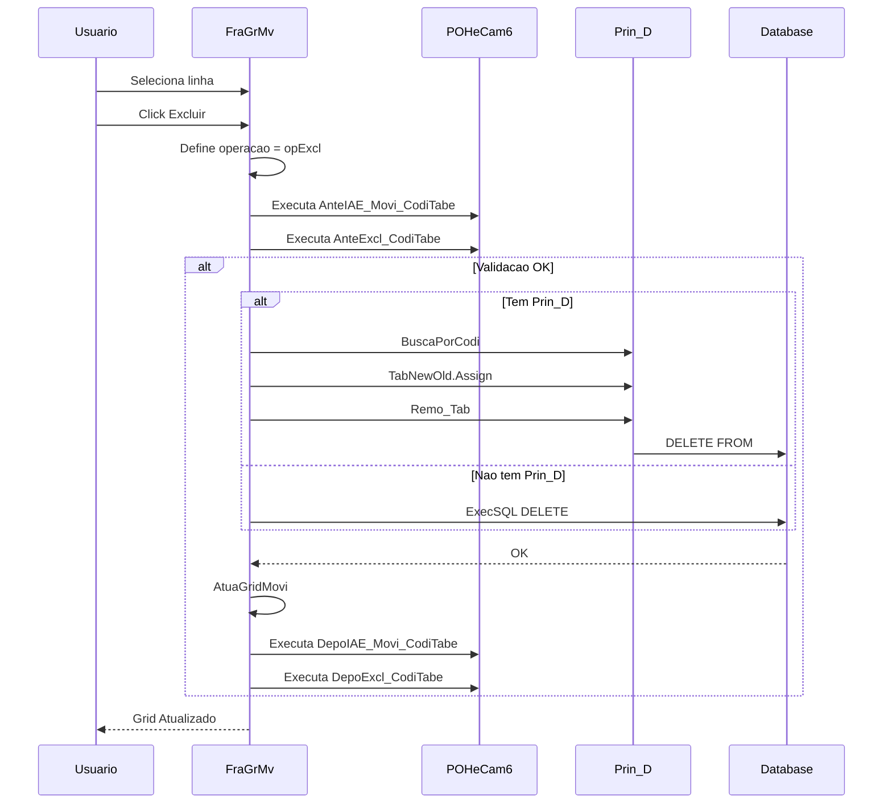

### 5.3 Duplo Clique no Grid (DbgGridDblClick - POFrGrMv.pas:472-475)

```pascal
procedure TFraGrMv.DbgGridDblClick(Sender: TObject);
begin
  BtnNovoClick(BtnAlte);  // Abre para alteracao
end;
```

### 5.4 Tratamento de Registro Orfao

Quando o usuario fecha o formulario de inclusao sem confirmar (Cancel ou X), o registro que foi inserido no banco durante a abertura precisa ser removido para evitar registros orfaos.

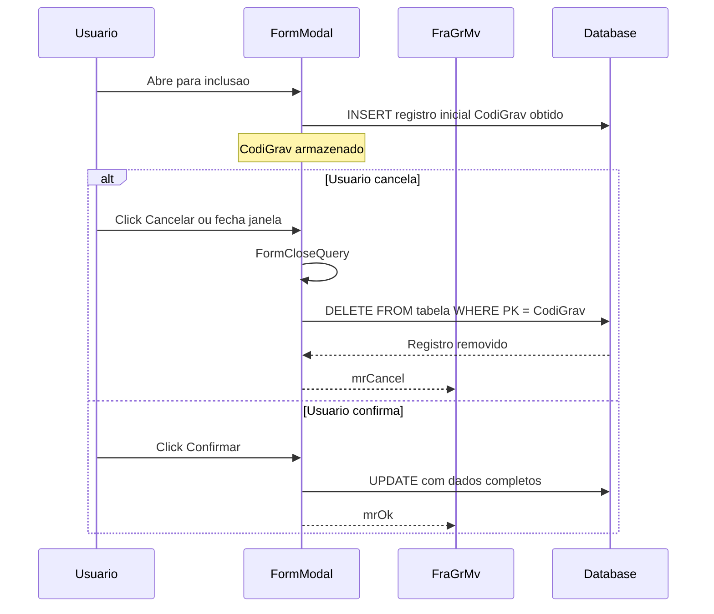

**Regra de Negocio**: O DELETE do registro orfao so ocorre quando:
- A operacao era de inclusao (nao alteracao)
- O usuario nao confirmou a operacao
- O registro ja foi persistido no banco

---

## 6. Sistema de Eventos dos Movimentos

### 6.1 Eventos Disponiveis

Os eventos sao definidos como campos especiais no POCAMP com nomenclatura:

| Evento | Momento | Descricao |
|--------|---------|-----------|
| `AnteIAE_Movi_<CodiTabe>` | Antes de I/A/E | Antes de qualquer operacao |
| `AnteIncl_<CodiTabe>` | Antes de Incluir | Validacoes pre-inclusao |
| `AnteAlte_<CodiTabe>` | Antes de Alterar | Validacoes pre-alteracao |
| `AnteExcl_<CodiTabe>` | Antes de Excluir | Validacoes pre-exclusao |
| `DepoIAE_Movi_<CodiTabe>` | Depois de I/A/E | Apos qualquer operacao |
| `DepoIncl_<CodiTabe>` | Depois de Incluir | Pos-processamento inclusao |
| `DepoAlte_<CodiTabe>` | Depois de Alterar | Pos-processamento alteracao |
| `DepoExcl_<CodiTabe>` | Depois de Excluir | Pos-processamento exclusao |
| `AtuaGrid_<CodiTabe>` | Apos abrir grid | Customizacao do grid |
| `ShowPai_Filh_<CodiTabe>` | Ao abrir form filho | Inicializacao do filho |

### 6.2 Fluxo de Eventos

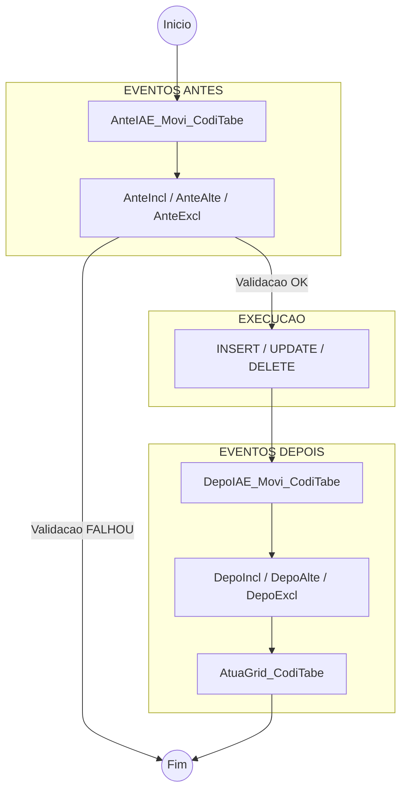

### 6.3 Exemplos Reais no Banco

```sql
-- Eventos encontrados no banco de dados
ANTEIAE_MOVI_16183
ANTEIAE_MOVI_83603
ANTEEXCL_25013
ANTEEXCL_25668
ATUAGRID_125
ATUAGRID_135
ATUAGRID_16183
...
```

---

## 7. Acesso a Componentes dos Movimentos

### 7.1 BuscaComponente (POHeCam6.pas:138-225)

O metodo `BuscaComponente` permite acessar componentes dos movimentos por nome padronizado:

| Padrao de Nome | Componente Retornado |
|----------------|----------------------|
| `QRYDAD0`, `QRYDADO0`, `QRY<CodiTabe>` | QryGrid do movimento |
| `DBGDAD0`, `DBGDADO0`, `DBG<CodiTabe>` | DbgGrid do movimento |
| `BTNNOV0`, `BTNINC0`, `BTNN<CodiTabe>` | BtnNovo do movimento |
| `BTNALT0`, `BTNA<CodiTabe>` | BtnAlte do movimento |
| `BTNEXC0`, `BTNE<CodiTabe>` | BtnExcl do movimento |
| `PNL<CodiTabe>` | PnlResu do movimento |

### 7.2 Exemplo de Uso em Eventos

```
// Em um evento do cabecalho, acessar grid do movimento 125:
ED,DBG125,ENABLED,0       // Desabilita grid do movimento 125
ED,BTNNOV125,VISIBLE,0    // Esconde botao Novo do movimento 125
```

---

## 8. Integracao com Decorator (Prin_D)

### 8.1 Hierarquia de Decorators

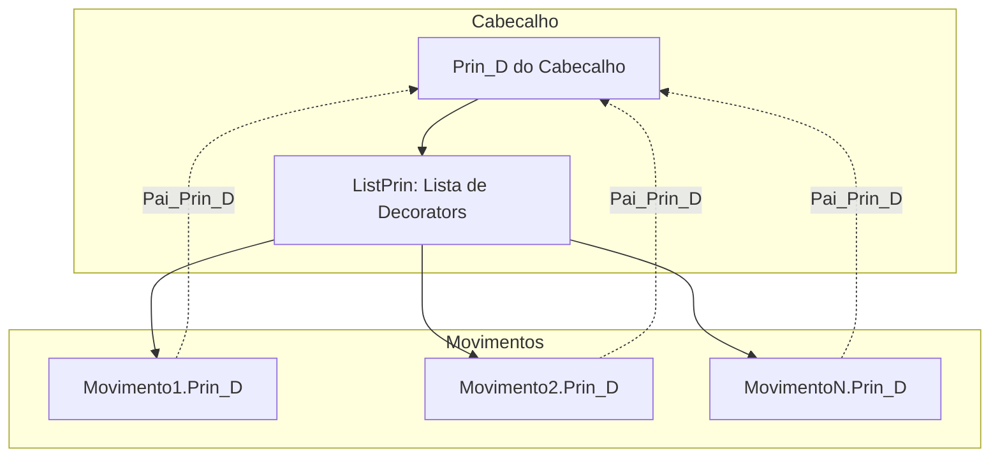

### 8.2 Configuracao (FormShow)

```pascal
// POHeCam6.pas:1002-1017
for I := 0 to ListMovi.Count-1 do
begin
  if Assigned(ListMovi[i].FraMovi.Prin_D) and Assigned(Prin_D) then
  begin
    ListMovi[i].FraMovi.Prin_D.Pai_Prin_D := Self.Prin_D;
    ListMovi[i].FraMovi.Prin_D.Conn := Self.Prin_D.Conn;
  end;
  ListMovi[i].FraMovi.PSitGrav := PSitGrav;
  ListMovi[i].FraMovi.Pai_Tabe.CodiGrav := DtsGrav.DataSet.Fields[0].AsInteger;
  ListMovi[i].FraMovi.sgTransaction := Self.sgTransaction;
end;
```

### 8.3 Operacoes via Decorator

O decorator gerencia:
- Lista de registros novos/alterados/excluidos
- Commit/Rollback em bloco
- Validacoes de integridade

---

## 9. Estrutura Visual

### 9.1 Layout com SERITABE maior que 50 - Mesma Guia

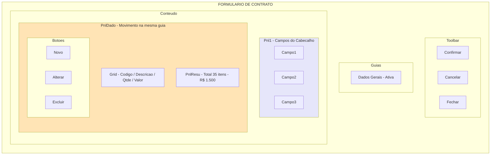

### 9.2 Layout com SERITABE menor ou igual a 50 - Guias Separadas

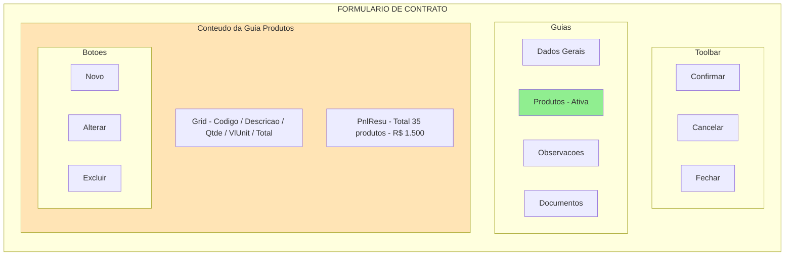

---

## 10. Exemplos Reais do Banco de Dados

### 10.1 Cabecalhos com Movimentos

| CabCodiTabe | CabNomeTabe | CabGravTabe |
|-------------|-------------|-------------|
| 8 | Tabela de Imposto | POCATBSF |
| 15 | Grupo de Empresas | POCAGREM |
| 80 | Colaboradores | FPGECOLA |
| 105 | Tabela de Calculos | FPCATABE |
| 112 | Faturamento por Empresas | POCAFAEM |
| 120 | Contratos | POCACONT |

### 10.2 Movimentos Exemplo

| MovCodiTabe | MovNomeTabe | MovGravTabe | CabeTabe | SeriTabe |
|-------------|-------------|-------------|----------|----------|
| 9 | Mov. Tabela de Imposto | POGEMVSF | 8 | 51 |
| 16 | Mov. Grupo de Empresas | POCAMVEM | 15 | 51 |
| 125 | Mov. Contratos | POCAMVCT | 120 | 2 |
| 133 | Mov. Grupos | POCAMVGR | 132 | 3 |
| 140 | Historico de Locacoes | FPCALOCA | 80 | 0 |

---

## 11. Fluxo Completo de Dados

### 11.1 Abertura de Formulario com Movimentos

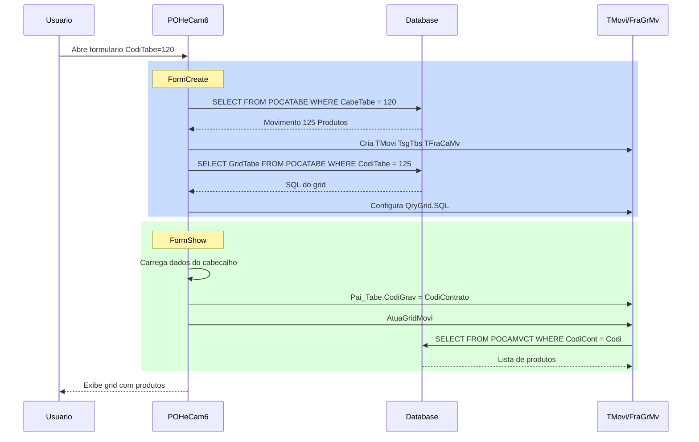

### 11.2 Inclusao de Movimento

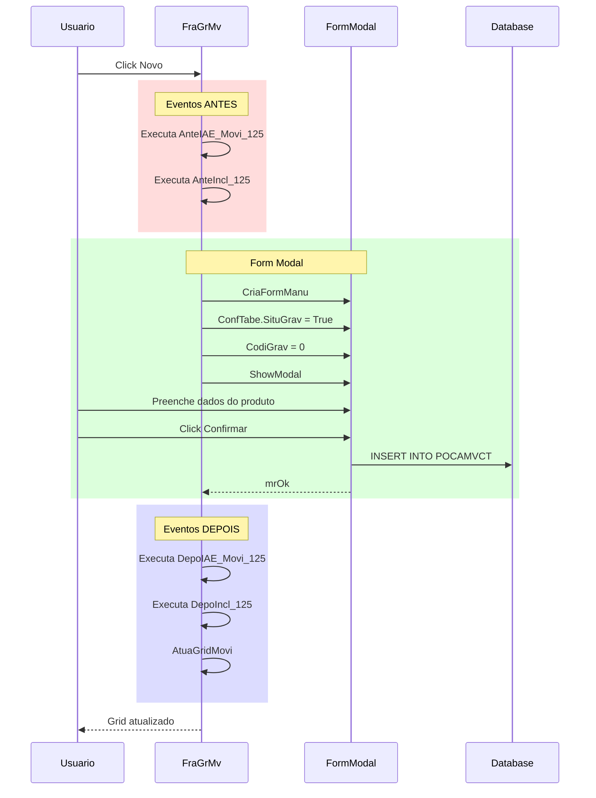

---

## 12. Diferencas Desktop vs Web (UniGUI)

### 12.1 Compilacao Condicional

```pascal
{$ifdef ERPUNI}
  // Codigo para UniGUI (Web)
  FormRelaModal := FrC.Create(uniGUIApplication.UniApplication);
{$else}
  // Codigo para VCL (Desktop)
  FormRelaModal := FrC.sgCreate(Self.FormParent, ...);
{$endif}
```

### 12.2 Diferencas Principais

| Aspecto | Desktop (VCL) | Web (UniGUI) |
|---------|---------------|--------------|
| Form Modal | TsgForm | TUniForm |
| Frame | TsgFrame | TUniFrame |
| Criacao | sgCreate | Create |
| Parent | TForm | TUniFrame/TUniForm |
| ShowModal | ShowModal | ShowModal |
| Modo Mobile | N/A | cwModoMobile |

### 12.3 Otimizacao de Layout (UniGUI)

No UniGUI, para evitar flicker e redesenhos excessivos durante a criacao de multiplos controles, o sistema utiliza `SuspendLayouts` e `ResumeLayouts`:

```pascal
// POHeCam6.pas - FormCreate
{$ifdef ERPUNI}
  Self.SuspendLayouts;     // Pausa redesenho
  try
    // Criacao de movimentos...
    for I := 0 to QryTabe.RecordCount - 1 do
    begin
      // Cria TMovi, TsgTbs, TFraCaMv...
    end;
  finally
    Self.ResumeLayouts;    // Retoma redesenho
  end;
{$endif}
```

**Beneficios**:
- Evita multiplos reflows do layout
- Melhora performance de carregamento
- Reduz consumo de banda (menos atualizacoes de DOM)

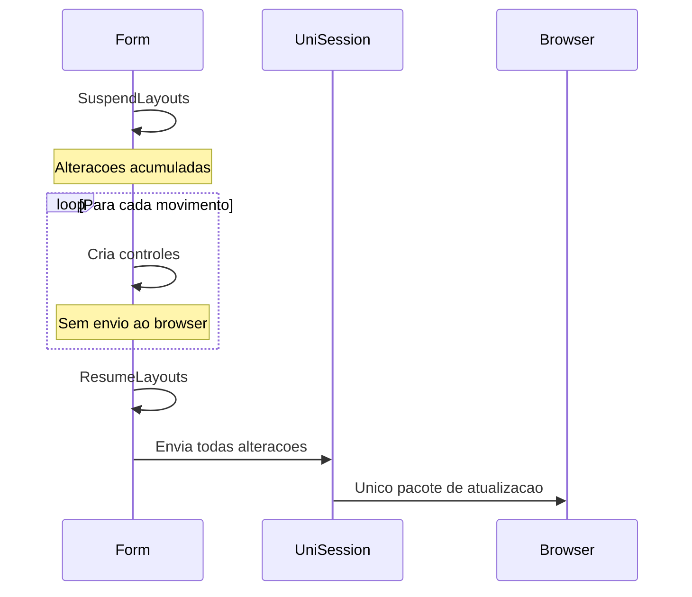

---

## 13. Consideracoes para Transposicao Web

### 13.1 Pontos Criticos

1. **Gestao de Estado**: No Delphi, o estado eh mantido em memoria do servidor. Na web, precisa ser serializado.

2. **Modais**: ShowModal bloqueia no Delphi, na web precisa ser assincrono.

3. **Transacoes**: sgTransaction eh compartilhada entre cabecalho e movimentos.

4. **Eventos**: Sistema de eventos PLSAG precisa ser executado no browser.

5. **Grids**: TsgDBG (DevExpress) precisa de equivalente web.

### 13.2 Perguntas para Validacao

1. Um cabecalho pode ter multiplos movimentos simultaneos?
2. Movimentos podem ter sub-movimentos (niveis)?
3. Como funciona o commit: por movimento ou em bloco?
4. PnlResu (resumo) eh sempre calculado automaticamente?
5. Existe limite de registros no grid de movimentos?

---

## 14. Glossario

| Termo | Definicao |
|-------|-----------|
| **Cabecalho** | Registro pai que contem os movimentos |
| **Movimento** | Registro filho vinculado ao cabecalho |
| **TMovi** | Classe wrapper que encapsula um movimento |
| **FraCaMv** | Frame container do movimento |
| **FraGrMv** | Frame do grid com botoes CRUD |
| **PgcMovi** | PageControl para movimentos na mesma guia |
| **PgcGene** | PageControl principal com guias separadas |
| **Prin_D** | Decorator para operacoes de negocio |
| **SERITABE** | Campo que define posicao visual do movimento |
| **CABETABE** | Campo FK para o cabecalho pai |

---

## 15. Proximos Passos

Apos validacao deste documento:

1. **Proposta de Arquitetura Web**: Definir como os movimentos serao implementados em ASP.NET MVC
2. **Mapeamento de Componentes**: Equivalentes web para TsgDBG, TsgBtn, etc.
3. **Sistema de Eventos**: Como executar eventos PLSAG nos movimentos
4. **Gestao de Estado**: Como manter o relacionamento cabecalho-movimentos
5. **API de CRUD**: Endpoints para operacoes nos movimentos

---

*Documento gerado em: 2025-12-29*
*Versao: 1.1 - AS-IS (complementado com POHeCam6)*

### Historico de Versoes

| Versao | Data | Descricao |
|--------|------|-----------|
| 1.0 | 2025-12-29 | Versao inicial do AS-IS |
| 1.1 | 2025-12-29 | Complementado com informacoes do POHeCam6: constantes, variaveis de controle, queries/DataModules, tratamento de registro orfao, campos POCATABE, otimizacao Web |
