# Sistema de Movimentos - Diagramas e Fluxos

## 1. Diagrama de Classes Simplificado

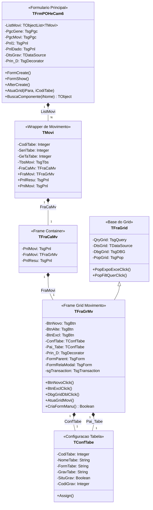

---

## 2. Diagrama de Sequencia - Abertura do Formulario

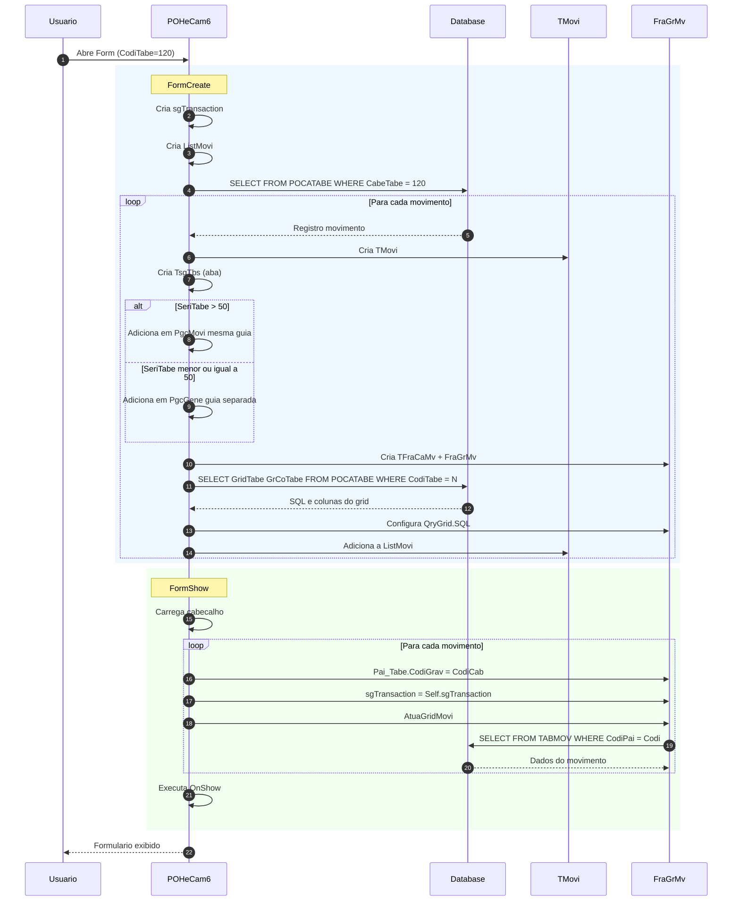

---

## 3. Diagrama de Sequencia - Incluir Movimento

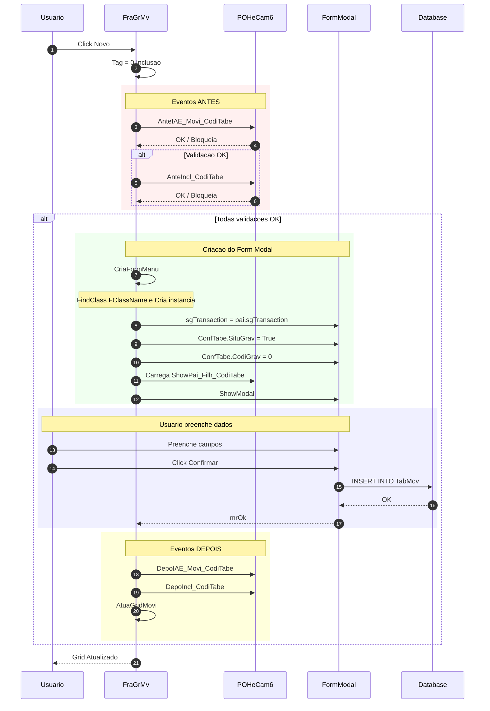

---

## 4. Diagrama de Sequencia - Excluir Movimento

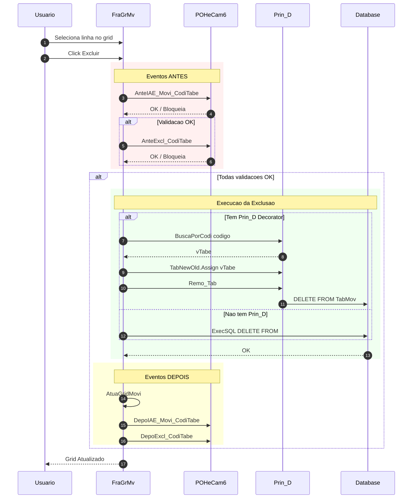

---

## 5. Fluxo de Eventos nos Movimentos

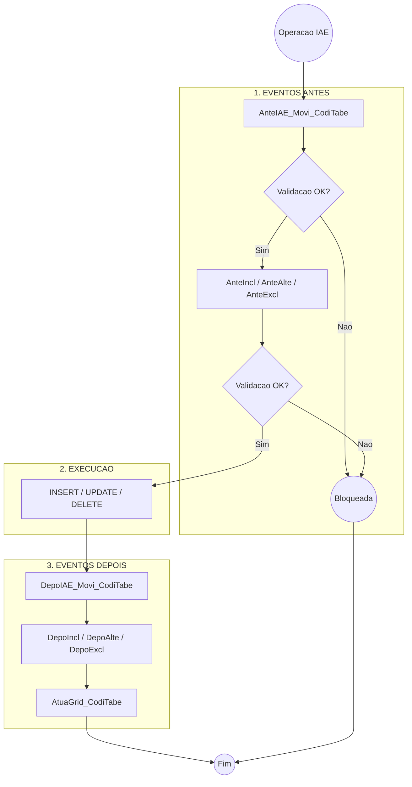

---

## 6. Fluxo de Criacao do Form Modal

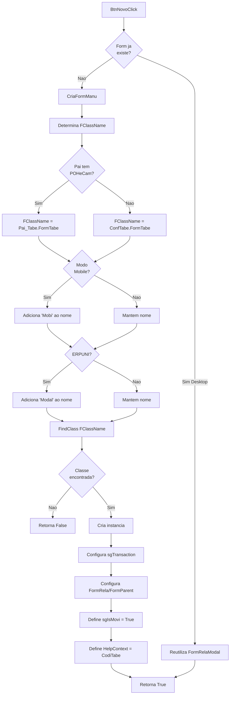

---

## 7. Relacionamento de Dados

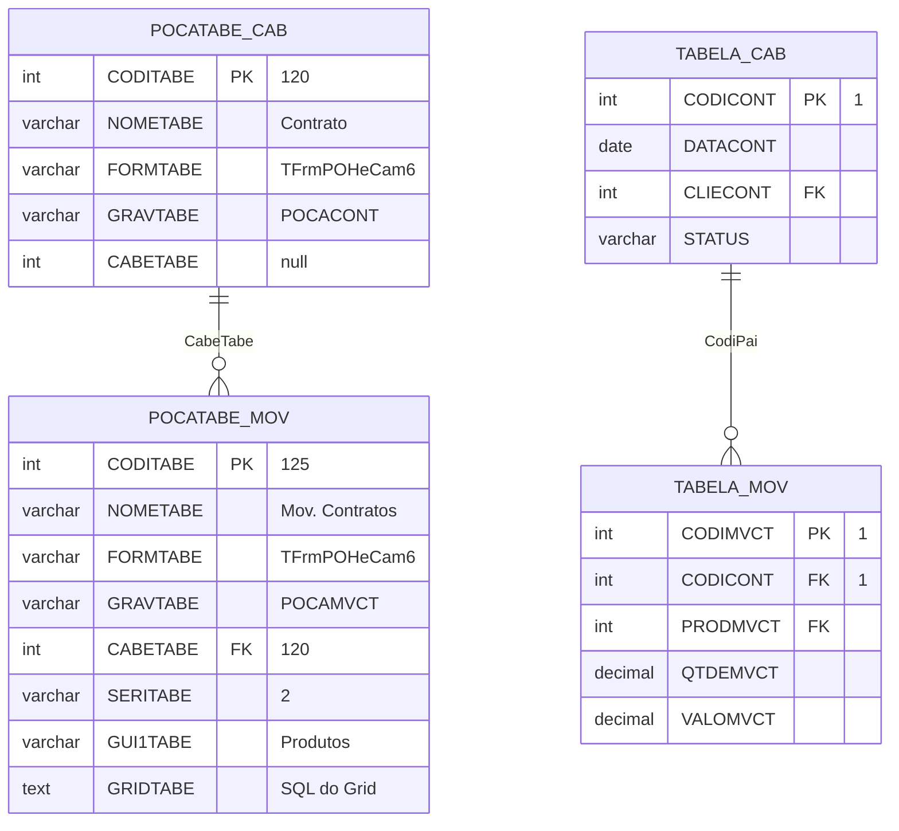

---

## 8. Maquina de Estados do Movimento

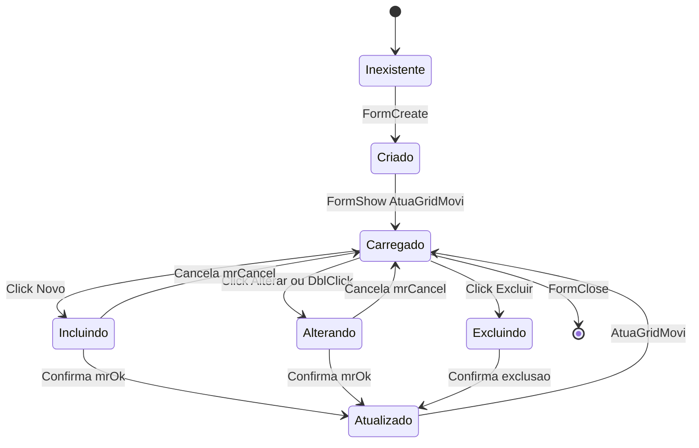

---

## 9. Hierarquia de Decorators

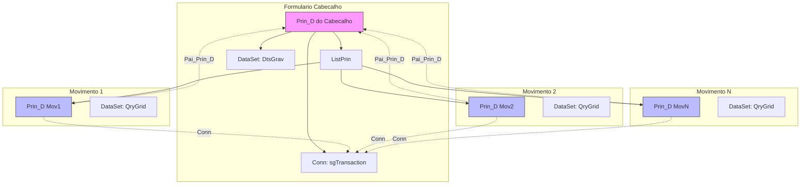

---

## 10. Layout Visual - Tipos de Exibicao

### 10.1 SERITABE maior que 50 - Movimento na Mesma Guia

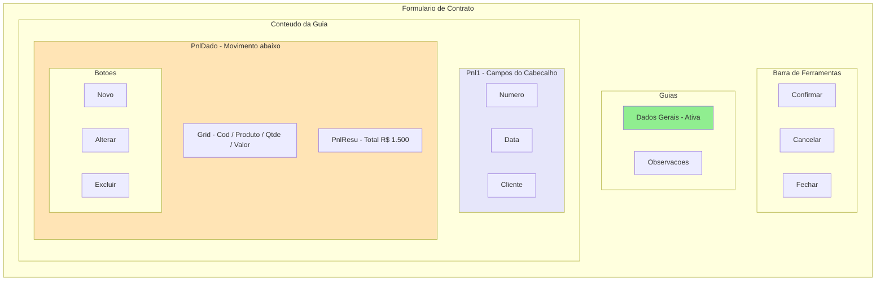

### 10.2 SERITABE menor ou igual a 50 - Movimento em Guia Separada

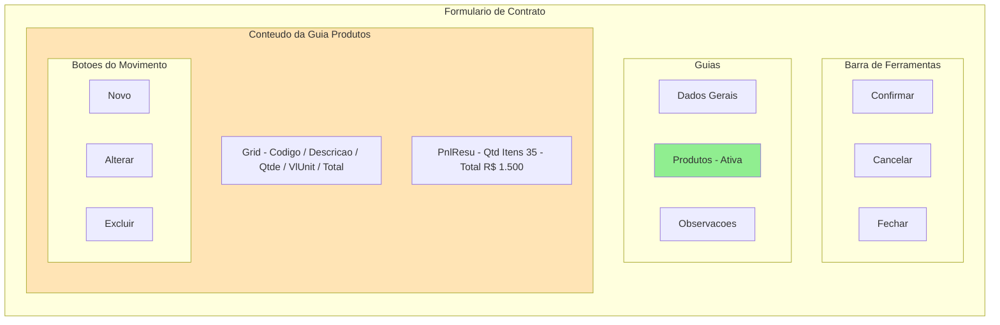

---

## 11. Fluxo Completo - Ciclo de Vida

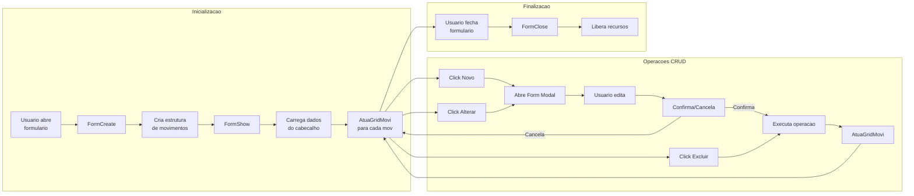

---

## 12. Acesso a Componentes por Nome

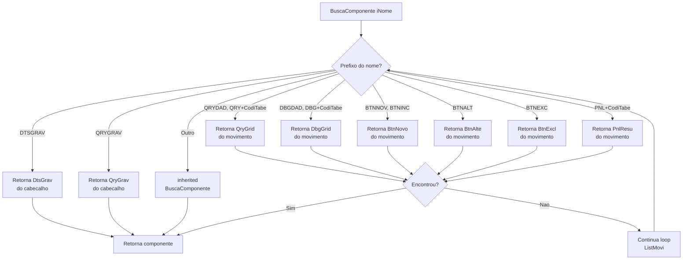

---

## 13. Checklist de Validacao

### 13.1 Estrutura Geral
- [ ] Um cabecalho (POCATABE com CabeTabe = null) pode ter N movimentos?
- [ ] SeriTabe > 50 significa movimento na MESMA guia do cabecalho?
- [ ] SeriTabe <= 50 significa movimento em guia SEPARADA?
- [ ] Multiplos movimentos podem aparecer em multiplas guias?

### 13.2 Comportamento CRUD
- [ ] Ao incluir movimento, o CodiGrav do pai eh automaticamente setado?
- [ ] A query do grid sempre filtra pelo codigo do cabecalho (:Codi)?
- [ ] Excluir usa Prin_D.Remo_Tab() quando decorator existe?
- [ ] Excluir usa DELETE direto quando nao ha decorator?

### 13.3 Sistema de Eventos
- [ ] AnteIAE_Movi_CodiTabe executa ANTES de qualquer operacao?
- [ ] Os eventos podem BLOQUEAR a operacao retornando False?
- [ ] DepoIAE_Movi_CodiTabe executa DEPOIS de qualquer operacao?
- [ ] AtuaGrid_CodiTabe executa apos o grid ser carregado?

### 13.4 Form Modal
- [ ] O form modal de edicao do movimento eh o MESMO form do cabecalho?
- [ ] A flag sgIsMovi = True indica que o form esta em modo de movimento?
- [ ] O form modal compartilha a mesma sgTransaction do pai?

### 13.5 Decorator (Prin_D)
- [ ] Pai_Prin_D do movimento aponta para Prin_D do cabecalho?
- [ ] ListPrin do cabecalho contem os Prin_D dos movimentos?
- [ ] O commit eh feito em bloco (cabecalho + movimentos)?

---

## 14. Comparativo Desktop vs Web

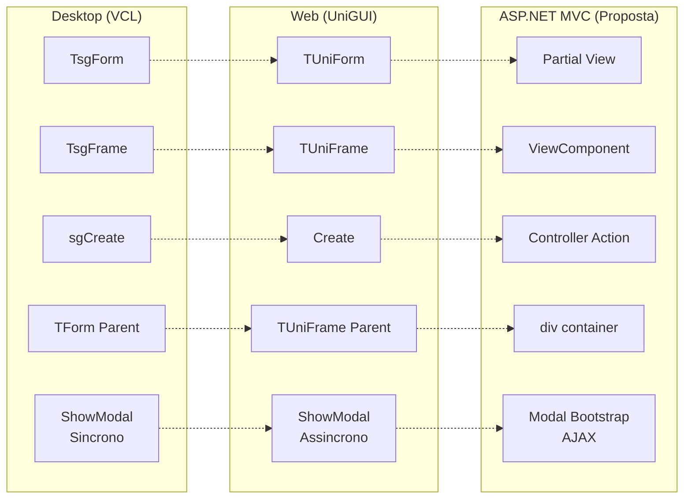

---

*Documento complementar para validacao visual do sistema de Movimentos*
*Versao: 1.0 - Mermaid*
